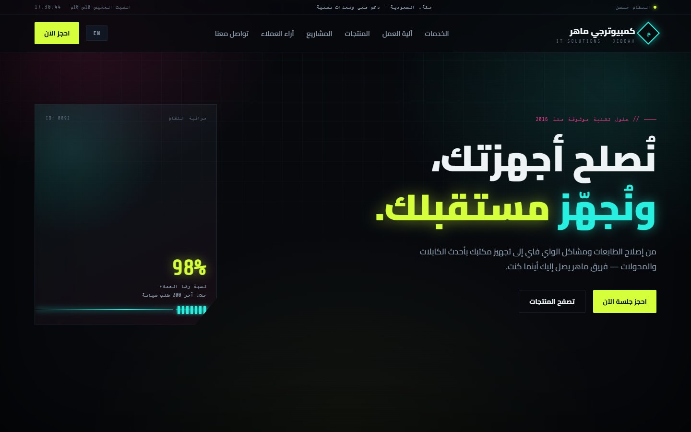
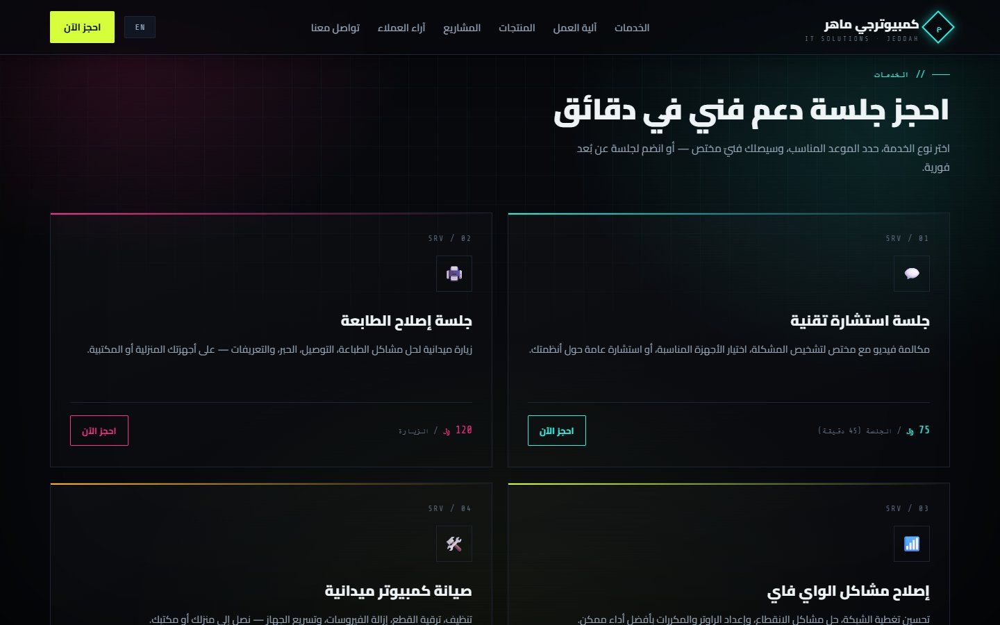
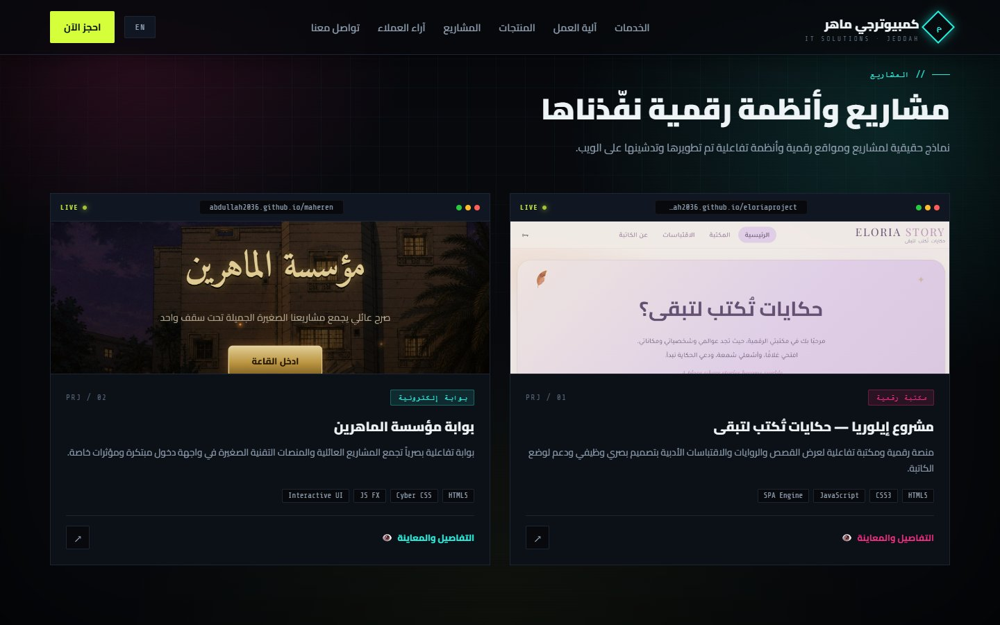
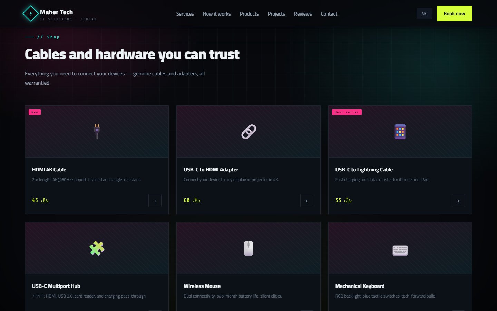
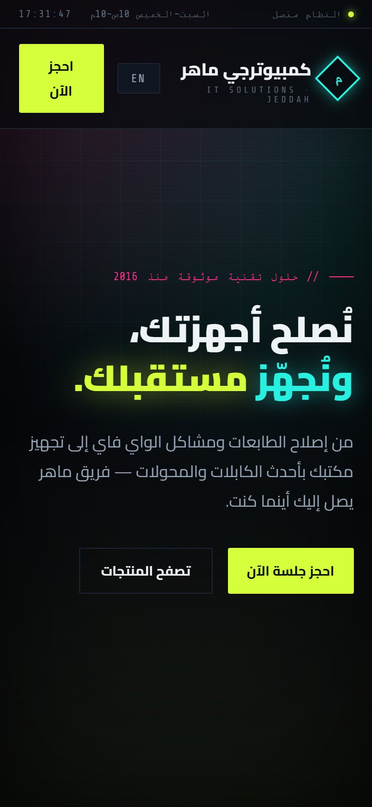

# Computerjy Maher — v1 · كمبيوترجي ماهر

A bilingual (Arabic / English) landing page for **Computerjy Maher**, a mock IT-services and hardware store, built in a dark cyberpunk / retro-terminal style with plain HTML, CSS and JavaScript.

This is the first version of a four-part series. Its brand, services, products and copy became the fixed content that every later version reuses; only the form changes between versions.

**Live:** https://abdullah2036.github.io/ComputerjyMaher/



## The series

| Version | Idea |
|---|---|
| **v1 (this repo)** | 2D cyberpunk / retro-terminal landing page |
| v2 · [computerjymaher3d](https://github.com/abdullah2036/computerjymaher3d) | First-person WebGL room, with the monitor as a portal into a 3D showroom |
| v3 · [computerjymaherV3](https://github.com/abdullah2036/computerjymaherV3) | "Night City": one continuous scroll-driven scene with a morphing particle field |
| v4 · [computerjymaherOS](https://github.com/abdullah2036/computerjymaherOS) | The studio as an operating system: a macOS-style desktop or an iOS-style phone |

## Features

- **Arabic-first, fully bilingual.** One button switches between Arabic (RTL) and English (LTR); every string comes from a single translation table.
- **Boot sequence and a live system clock** in the top status bar, to fit the terminal theme.
- **Services with booking.** Each service card opens WhatsApp with a pre-filled booking message, so there's no backend to run.
- **Products shelf.** Buying a product also opens a pre-filled WhatsApp message and shows a toast.
- **Projects gallery.** Filter by category and open any project in a detail modal with a live preview, description, client, year and tech stack.
- **"How it works" steps, reviews and a contact call-to-action**, all revealed on scroll with `IntersectionObserver`.
- **Responsive** from phone to desktop.

## Screenshots

| | |
|---|---|
|  |  |
|  |  |

## Tech stack

- HTML5, CSS3 and vanilla JavaScript, with no frameworks and no build step
- Google Fonts: Cairo (Arabic), Orbitron and Share Tech Mono (the terminal look)
- GitHub Pages for hosting

## Run locally

It's a static site, so either open `index.html` in a browser or serve the folder:

```bash
git clone https://github.com/abdullah2036/ComputerjyMaher.git
cd ComputerjyMaher
python -m http.server 8000     # then open http://localhost:8000
```

## Project structure

```
ComputerjyMaher/
├── index.html          page markup: status bar, nav, hero, services, how-it-works,
│                       products, projects, reviews, contact, project modal
├── styles.css          theme, grid background, glitch/neon effects, responsive layout
├── script.js           translations (ar/en), boot screen, clock, scroll reveal,
│                       WhatsApp booking, project filter + modal
└── assets/projects/    project screenshots used in the gallery
```

## Notes

Computerjy Maher is a mock brand used as a front-end testbed. There is no cart or payment. Every action that would cost money opens a WhatsApp chat instead.

---

Built by **Abdullah Bokhary** · [Portfolio](https://abdullah.pageui.workers.dev/) · [LinkedIn](https://www.linkedin.com/in/abdullah-bokhary-840315326/) · [GitHub](https://github.com/abdullah2036)
